# Лабораторная работа 1

## Построение сети
Схема сети:

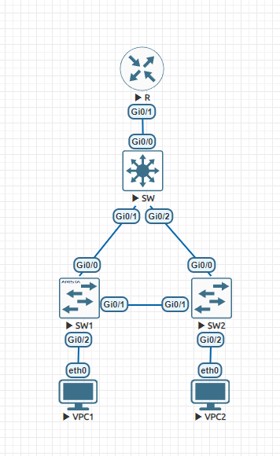

Конфигурация каждого из устройств:

### VPC:
- Ставим pcname
- Назначаем адрес в сети, маску и gw
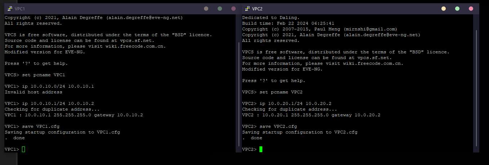

### SW1/2:
- Назначаем человеческое имя
- Объявляем vlan
- Настраиваем прокидку vlan в SW, SW2
- Настраиваем gi 0/2 чтобы создать vlan10
- Сохраняем конфиг 

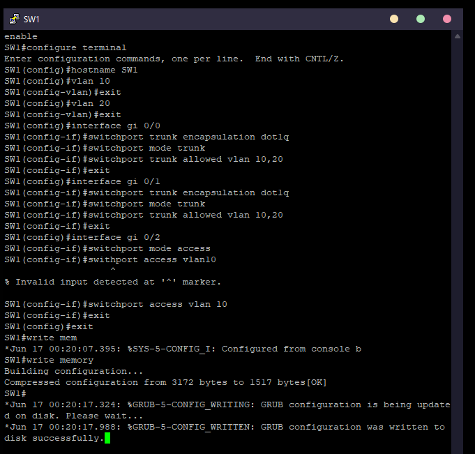

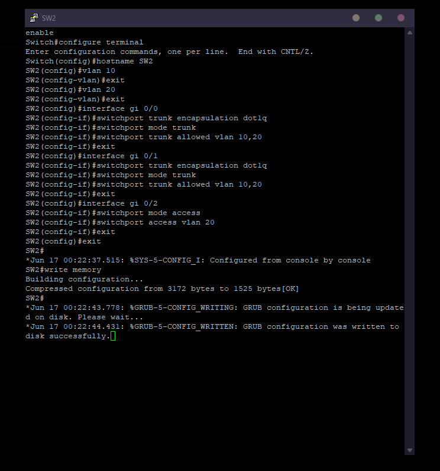

### SW
- Назначаем человеческое имя
- Объявляем vlan
- Настраиваем прокидку vlan в SW1/2, R
- Назначаем vlan 10,20 корнем STP tree
- Сохраняем конфиг

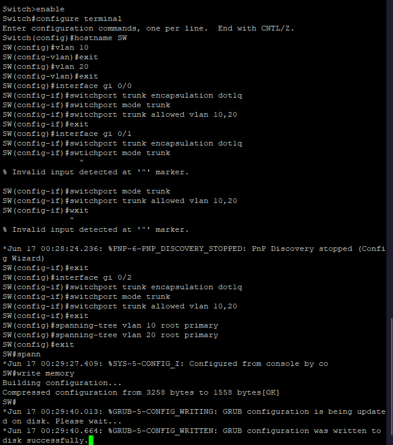

### R
- Назначаем человеческое имя
- Включаем gi 0/1
- Создаем 2 subif для разных vlan
- Сохраняем конфиг

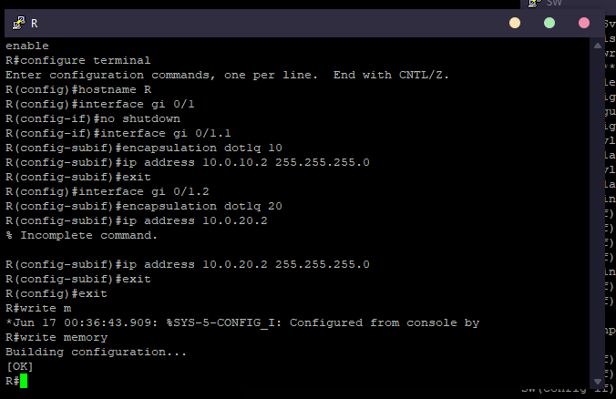

## Результат

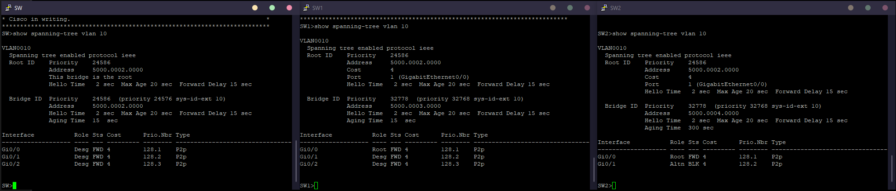

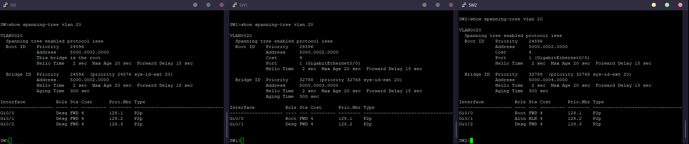

Пинги:

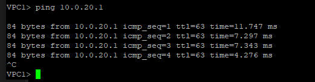

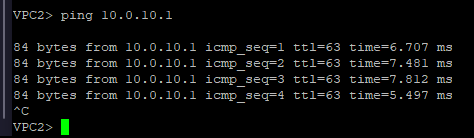

### Эксперимент 1(SW -x> SW1):

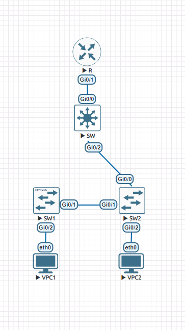

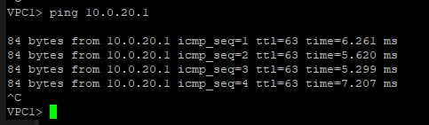

### Эксперимент 2(SW1 <-x-> SW2):

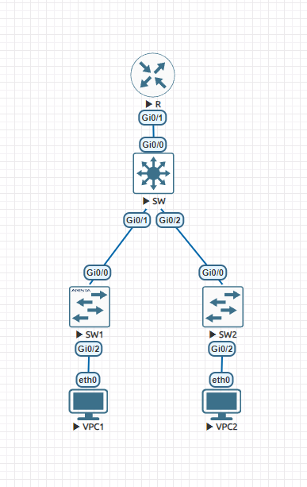

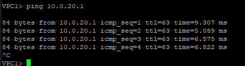

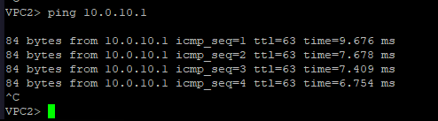

### Эксперимент 3(SW -x> SW2):

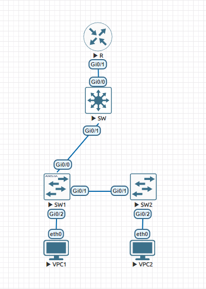

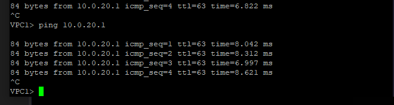

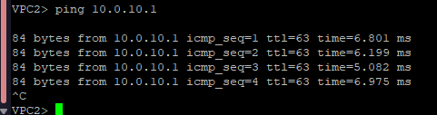